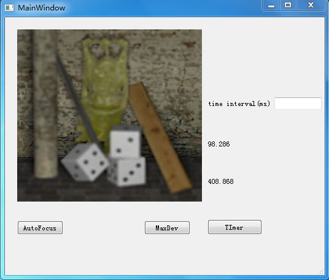

# Halcon_LearningRecoed

#### 介绍
记载一些在编程及图像处理过程中的问题及解决方案，主要包括QT与C++的一些实用小项目，Halcon及Opencv的图像处理相关解决方案，主要是自己学习的一些记录内容，只是用于学习，涉及的相关借鉴内容的我尽量标明出处，如涉及版权问题，请联系删除。

#### 软件环境
Qt：5.9.6
vs2019
Halcon 12.0/17.0

#### 子项目介绍

* 1.ARM_FontSet

* 2.CustomView

* 3.ImageScale

* 4.Draw_Item

* 5.AutoFacus

* 6.LockerTest

* 7.CustomToolBox

* 8.AutoRepeat_Test

* 9.SwitchButton

* 10.Balser_GigeDemo

* 11.QtCameraDemo

* 12.VideoTracking

#### 文件夹说明

1.  snap
此文件夹为各子工程界面截图
2.  File_Info
此文件夹存放工程所需文件，如图像/txt/ini
3.  bin
此文件夹存放工程创建的exe文件

