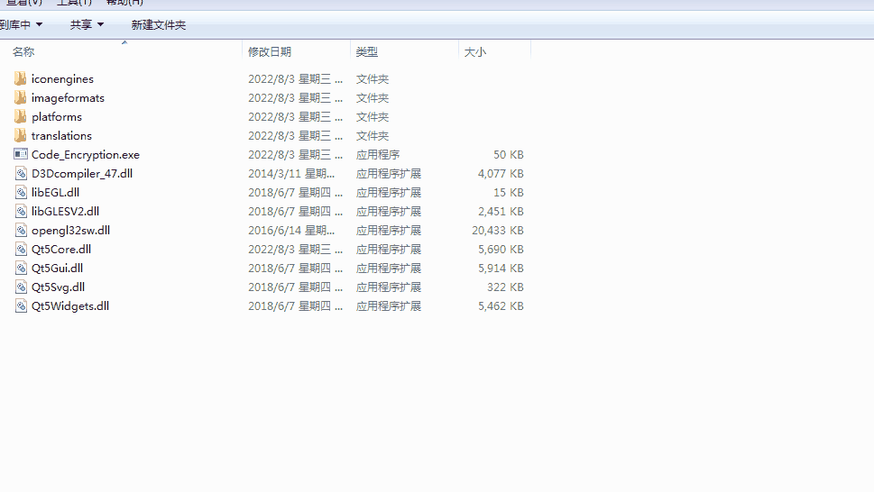

# Halcon_LearningRecord

#### 介绍
记载一些在编程及图像处理过程中的问题及解决方案，主要包括QT与C++的一些实用小项目，Halcon及Opencv的图像处理相关解决方案，主要是自己学习的一些记录内容，只是用于学习，涉及的相关借鉴内容的我尽量标明出处，如涉及版权问题，请联系删除。

#### 软件环境
Qt：5.9.6
vs2019
Halcon 12.0/17.0

#### 子项目介绍

* 1.ARM_FontSet
**功能：**实现Halcon界面设定的文字字体和大小设置。

* 2.CustomView
**功能：**实现超大像素图像读取/显示功能。

* 3.ImageScale
**功能：**实现图像缩放平移功能。

* 4.Draw_Item
**功能：**实现QGraphicsView的自定义Item组件。

* 5.AutoFacus
**功能：**实现图像自动对焦评价系数参考。

* 6.LockerTest
**功能：**实现Qt抽屉展开折叠显示功能。

* 7.CustomToolBox
**功能：**实现Qt控件操作使用功能。

* 8.AutoRepeat_Test
**功能：**Qt实现QPushButton长按触发事件。

* 9.SwitchButton
**功能：**Qt实现开关控件效果。

* 10.Balser_GigeDemo
**功能：**Balser工业相机采图及参数设置。

* 11.QtCameraDemo
**功能：**Qt实现USB多摄像头视频、抓图及参数设置。

* 12.VideoTracking
**功能：**Qt+OpenCV实现USB摄像头监测移动物体。

* 13.GrayTo3channel
**功能：**Qt实现8位灰度图叠加通道转换成24位三通道图像。

* 14.Code_Encryption
**功能：**Qt实现软件使用次数限制。

* 15.Dynamic_setStyle
**功能：**Qt实现控件背景的qss。

* 16.printTest
**功能：**美松打印机打印测试程序。

* 17.rtsp_Display
**功能：**Qt调用VLC-Qt库实现拉流播放。

* 18.videoPlay
**功能：**基于OPenCV的视频播放器。

* 19.transTest
**功能：**Qt的中英文动态翻译。

* 20.SingleApplationTest
  **功能：**Qt程序单例化测试。

* 21.PixelPos_MouseFollow
  **功能：**Qt实现实时获取图像坐标和像素值。

#### 文件夹说明

1.  snap
此文件夹为各子工程界面截图
2.  File_Info
此文件夹存放工程所需文件，如图像/txt/ini
3.  bin
此文件夹存放工程创建的exe文件
4.  Halcon_StudyProject
此文件存放Halcon学习过程中的一些实际例子
5.  OpenCV_LearningProject
此文件存放OpenCV学习过程中的一些例子

